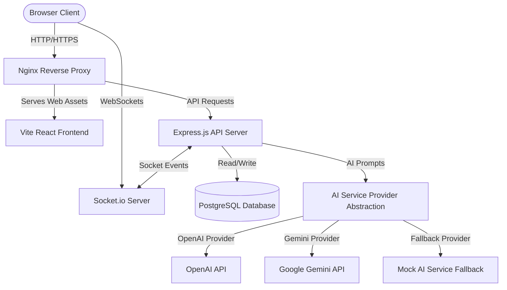
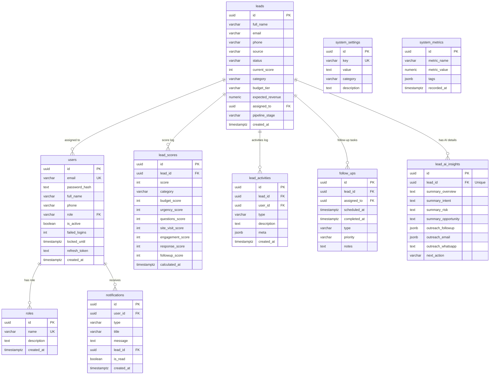
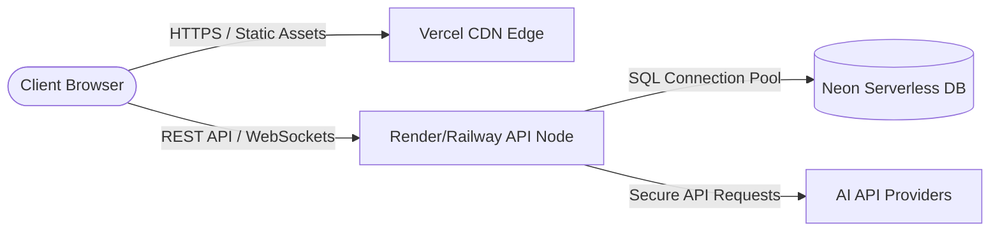
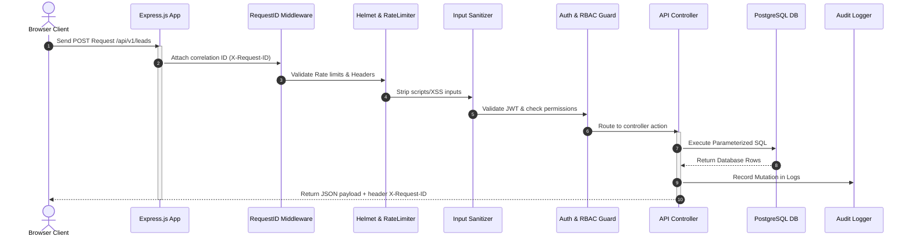
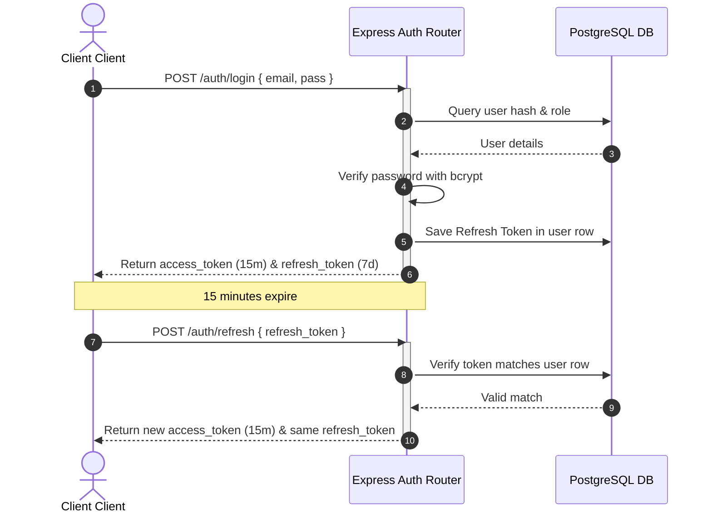
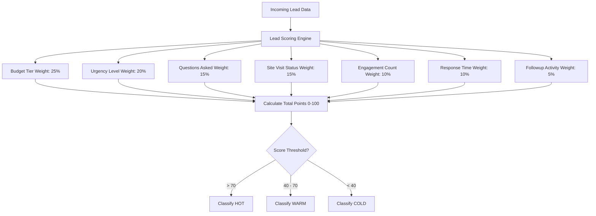
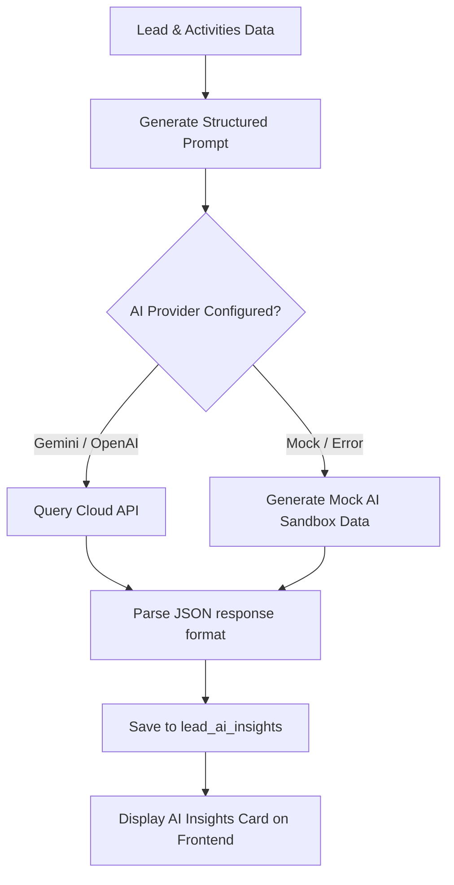

# Architecture & Processing Flow Diagrams
**Lohithadharma Lead Scoring Dashboard**

This document visualizes the system's architecture, database schemas, deployment pipelines, and core processes using Mermaid diagrams.

---

## 1. System Architecture

Shows the end-to-end component setup, client communication, and service boundaries.

---

## 2. Database ER Diagram

Visualizes database tables, columns, indexes, and primary/foreign key relationships.

---

## 3. Deployment Diagram

Visualizes production cloud deployment topology using Neon, Render/Railway, and Vercel.

---

## 4. API Request Flow

Tracing a standard request cycle (including Request IDs, helmet safety headers, sanitizers, and RBAC auth).

---

## 5. Authentication Sequence

Demonstrates JWT access tokens, DB refresh checks, and sliding session logic.

---

## 6. Lead Scoring Pipeline

Shows how lead profiles are weighed across 7 factors by the scoring service.

---

## 7. AI Analysis & Outreach Generation Flow

Visualizes how AI summaries and outreach messages are created and served.

